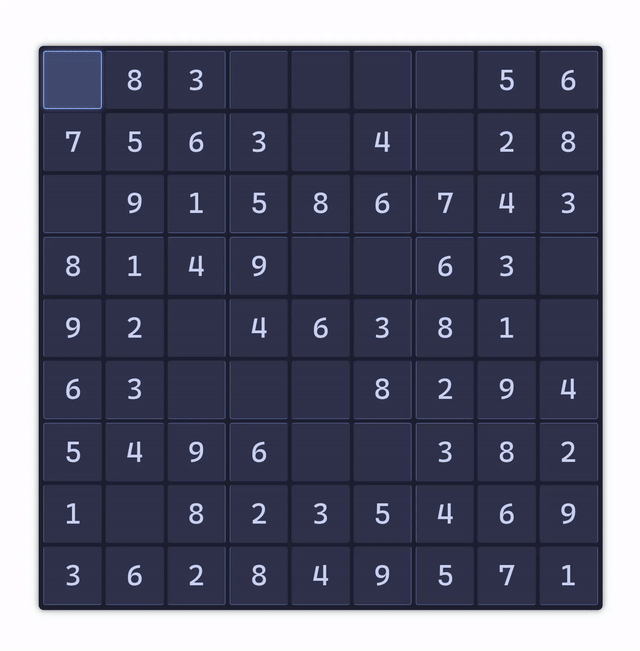

# @vimazing/vim-sudoku

[](https://www.npmjs.com/package/@vimazing/vim-sudoku)
[](https://www.npmjs.com/package/@vimazing/vim-sudoku)
[](https://github.com/vimazing/vim-sudoku/blob/main/LICENSE)



Lightweight, typed **React hooks** and utilities for building interactive sudoku games with **VIM-style modal editing**.

Part of the [VIMazing](https://vimazing.com) project - [GitHub](https://github.com/andrepadez/vimazing-vimaze).

---

## Contents
- [Features](#features)
- [Installation](#installation)
- [Quick Start](#quick-start)
- [VIM Modal Editing](#vim-modal-editing)
- [Core Hooks](#core-hooks)
- [Game Mechanics](#game-mechanics)
- [Example App](#example-app)
- [Build & Release](#build--release)
- [License](#license)

---

## Features
- 🎮 **VIM modal editing** – Navigate in normal mode, edit cells in insert mode (R/C to enter)
- ⌨️ **Full VIM motions** – `h`/`j`/`k`/`l`, counted moves, `^`/`$`/`0` for row navigation
- 🎯 **Smart cell locking** – Pre-filled clues are protected with visual feedback
- ⏱️ **Time & keystroke limits** – Configurable game-over conditions
- 📊 **Built-in scoring** – Time-based scoring with keystroke tracking
- 🎨 **Tokyo Night theme** – Beautiful dark theme with 3x3 box separators
- 📦 **Typed API** – Full TypeScript support with generated declarations
- 🪝 **Composable hooks** – Separate concerns for game state, rendering, input, and scoring
- 🌲 **Tree-shakeable exports** – Import only what you need

---

## Installation

Using **npm**:

```bash
npm install @vimazing/vim-sudoku
```

Or with **bun**:

```bash
bun add @vimazing/vim-sudoku
```

---

## Quick Start

```tsx
import { useGame } from "@vimazing/vim-sudoku";
import "@vimazing/vim-sudoku/sudoku.css";

export function SudokuGame() {
  const { containerRef, initGame, gameStatus, scoreManager } = useGame();

  return (
    <div>
      <h1>VIMazing Sudoku</h1>
      <button onClick={initGame}>New Puzzle</button>
      
      <div className="relative w-fit">
        <div ref={containerRef} />
      </div>
      
      {gameStatus === "game-won" && (
        <p>🎉 Score: {scoreManager.finalScore?.toLocaleString()}</p>
      )}
    </div>
  );
}
```

---

## VIM Modal Editing

VIMazing Sudoku follows VIM's modal editing philosophy with strict insert/replace semantics:

### Navigation Mode (default)

#### Movement

| Key | Action | Notes |
| --- | ------ | ----- |
| `h` / `j` / `k` / `l` | Move cursor left/down/up/right | Core VIM navigation |
| `<count>h/j/k/l` | Move with count | e.g., `3j` = down 3, `5l` = right 5 |
| `0` / `^` | Jump to start of row | Move to column 0 |
| `$` | Jump to end of row | Move to column 8 |
| `.` | Repeat last motion | Repeat with optional new count |

#### Editing

| Key | Action | Valid On |
| --- | ------ | -------- |
| `I` | Enter insert mode | ✅ Empty cells only |
| `R` | Enter replace mode | ✅ User-filled cells only |
| `D` / `X` | Delete cell value | ✅ User-filled cells only |

#### Game Control

| Key | Action |
| --- | ------ |
| `Q` | Quit game |

### Edit Mode (I/R to enter)

| Key | Action |
| --- | ------ |
| `1-9` | Fill cell with number |
| `x` / `Backspace` | Clear cell |
| `Esc` / `Enter` | Exit edit mode back to navigation |

---

## Cell State Rules

Understanding cell states is crucial for VIM-style editing:

| Cell State | `I` (Insert) | `R` (Replace) | `D`/`X` (Delete) | Visual |
| ---------- | ------------ | ------------- | ---------------- | ------ |
| **Empty** (`.`) | ✅ Enter edit | 🔴 Flash (use I) | ➖ No effect | Normal |
| **User-filled** | 🔴 Flash (use R) | ✅ Enter edit | ✅ Delete | Normal |
| **Pre-filled clue** | 🔴 Flash (locked) | 🔴 Flash (locked) | 🔴 Flash (locked) | Darker text |

### Visual Feedback

- 🔵 **Blue glow** – Navigation mode (current cell)
- 🟡 **Yellow pulsing glow** – Edit mode (typing active)
- 🔴 **Red flash** – Invalid action (wrong mode, locked cell, or out of bounds)

### Examples

```
Empty cell:     Press I → type 5 → Esc
Replace value:  Press R → type 7 → Esc  
Delete value:   Press D (instant)
Move 3 down:    Press 3j
Jump to end:    Press $
```

---

## Core Hooks

### `useGame(platformHook?, options?)`

Main hook that orchestrates the entire sudoku game.

**Options:**
- `validateMoves?: boolean` (default: `false`) - Enable real-time move validation with conflict detection. When `false`, allows harder gameplay without immediate feedback.

**Returns:**

```ts
{
  // Core
  containerRef: RefObject<HTMLDivElement>,
  gameStatus: GameStatus,  // "waiting" | "started" | "game-won" | "game-over"
  startGame: () => void,
  stopGame: () => void,
  initGame: () => void,    // Reset board + start
  
  // Cursor
  cursor: { r: number; c: number },
  moveCursor: (dr, dc, steps?) => void,
  
  // Board
  board: string,           // 81-character string
  initialBoard: string,    // Original clues
  setDigit: (digit) => void,
  erase: () => void,
  reset: () => void,
  solveBoard: () => void,
  boardToString: (human?) => string,  // Format board for display
  
  // Scoring
  scoreManager: {
    timeValue: number,     // Time in milliseconds
    finalScore: number | null,
    timeLimit: number,     // 60000ms (60 seconds)
    keystrokeLimit: number, // 100 keystrokes
  },
  
  // Key logging
  keyLog: KeyLogEntry[],
  editMode: "navigation" | "edit",
}
```

### Individual Hooks

Export individual hooks for granular control:

```ts
import { useScore } from "@vimazing/vim-sudoku/useScore";
import { useBoardState } from "@vimazing/vim-sudoku/useGame/useBoardState";
```

---

## Game Mechanics

### Scoring

Scoring formula with time and move penalties:
```
score = max(0, 100000 - timeInSeconds × 10 - extraMoves × 50)
```

Where:
- `baseScore = 100000`
- `timePenalty = timeInSeconds × 10`
- `extraMoves = actualKeystrokes - minMovesRequired`
- `movePenalty = extraMoves × 50`

### Game Over Conditions

- ⏱️ **Time limit**: 60 seconds
- ⌨️ **Keystroke limit**: 100 keystrokes

Customize in `src/useScore/useScore.ts`:
```ts
const TIME_LIMIT_MS = 60000;
const KEYSTROKE_LIMIT = 100;
```

### Win Detection

Automatic win detection is fully implemented using an efficient sum-to-45 algorithm:
- Validates when board is complete (no empty cells)
- Checks all rows sum to 45 (1+2+...+9)
- Checks all columns sum to 45
- Checks all 3x3 boxes sum to 45

Manual win trigger available via `solveBoard()` for testing.

### Board Format

```ts
// Computer format (compact)
boardToString()  // "628.1...535928671..."

// Human format (readable)
boardToString(true)
// 6 2 8 | 1 . . | . 5 .
// 5 3 9 | 2 4 8 | 6 7 1
// ...
```

---

## Example App

A demo application lives under `example/` and consumes the package directly.

```bash
cd example
bun install
bun run dev
```

During local development the Vite config aliases `@vimazing/vim-sudoku` to the source folder so you can iterate without rebuilding. When publishing, run the build first (see below) so editors consume the generated declarations in `dist/`.

---

## Build & Release

Build the distributable bundle and type declarations:

```bash
bun run build
```

This writes JavaScript, type definitions, and styles to `dist/`. The `prepublishOnly` hook reuses the same command to guarantee fresh artifacts before publishing.

---

## License

MIT © [André Padez](https://github.com/andrepadez)
